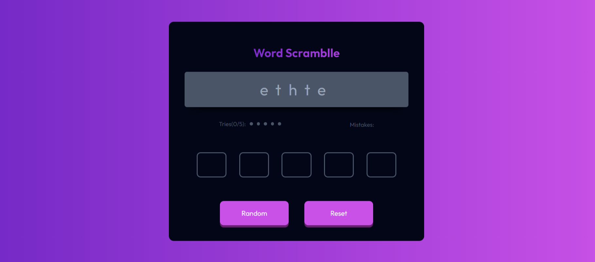

# Word Scramble Game

## Table of contents

- [Word Scramble Game](#word-scramble-game)
  - [Table of contents](#table-of-contents)
  - [Overview](#overview)
    - [The challenge](#the-challenge)
    - [Screenshot](#screenshot)
    - [Links](#links)
  - [My process](#my-process)
    - [Built with](#built-with)
  - [Author](#author)

## Overview

### The challenge

Users Stories:

- Create a guess the word game that matches the given design.
- Use HTML to create the basic structure.
- Use Vanilla JavaScript to add interactivity.
- Users can see a random scrambles word when the page is first loaded or after users click the random button.
- Users can enter one letter at a time. After each attempt, the input should automatically focus on the next input if it exists.
- Users can regenerate a new scrambles word by selecting the random button.
- Users can rest all inputs, mistakes, and tries by selecting the reset button.
- When the user completes the game, it should show a _'🎉 Success'_ alert.
- The page should be responsive on different screen sizes.
- Deploy the solution and submit Respository URL and Demo URL.

### Screenshot

### Links

- Live Site URL: [Live site URL here](https://game-wordd-scramble.netlify.app/)

## My process

### Built with

- Semantic HTML5 markup
- CSS custom properties
- Flexbox
- CSS Grid
- Mobile-first workflow
- ES6 Classess
- [Sass](https://sass-lang.com/documentation/) - For styles
- [TypeScript](https://www.typescriptlang.org/docs/handbook/2/basic-types.html) - For type definations

## Author

- Twitter - [@prince_popups](https://www.twitter.com/prince_popups)
